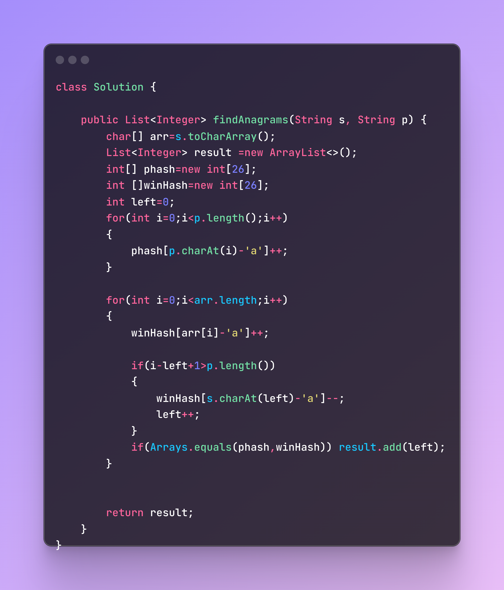
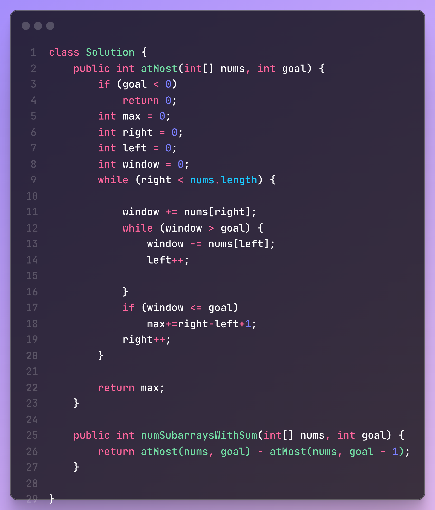
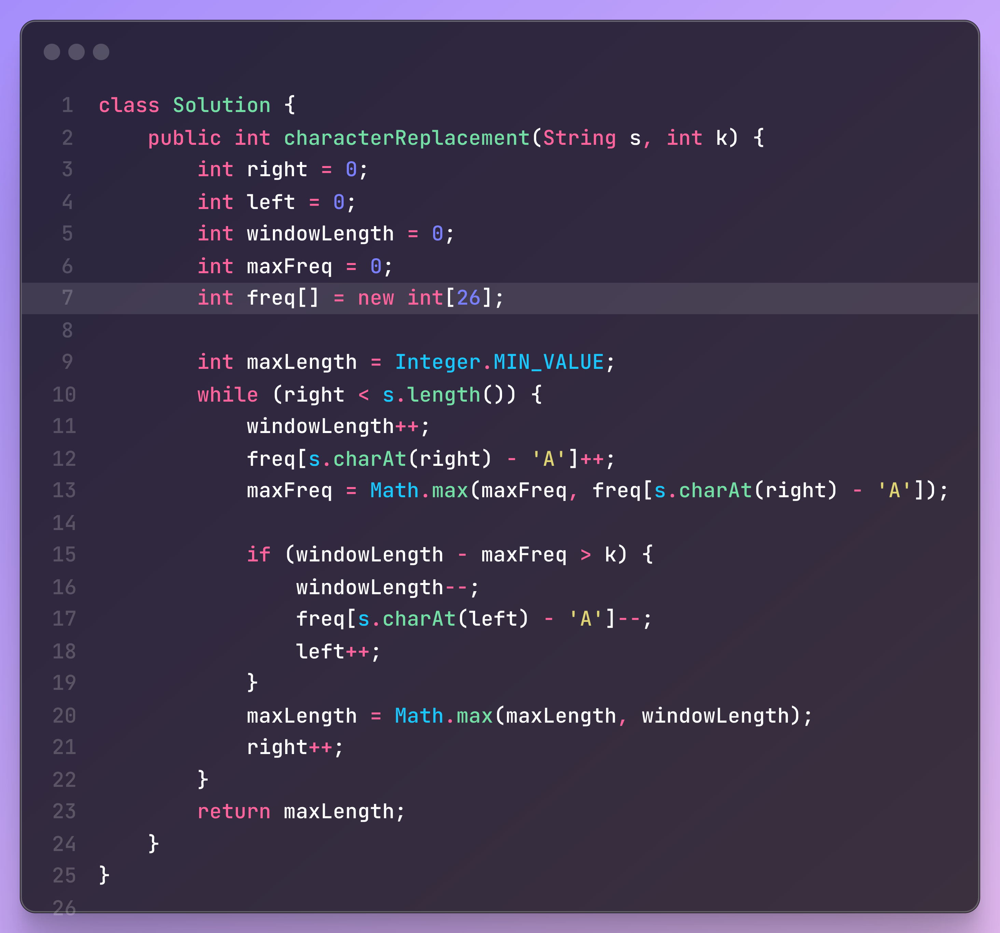

# Problems

### 1. **Find All Anagrams in a String**
       
    Given two strings s and p, return an array of all the start indices 
    of p's anagrams in s. You may return the answer in any order.


    Example 1:

    Input: s = "cbaebabacd", p = "abc"
    Output: [0,6]

Explanation:

The substring with start index = 0 is "cba", which is an anagram of "abc".
The substring with start index = 6 is "bac", which is an anagram of "abc".



### 2. **Binary Subarrays with sum k**

    Given a binary array nums and an integer goal, return the number of non-empty subarrays with a sum goal.

    A subarray is a contiguous part of the array.

    Example 1:
    
    Input: nums = [1,0,1,0,1], goal = 2
    Output: 4
    Explanation: The 4 subarrays are bolded and underlined below:
    [1,0,1,0,1]
    [1,0,1,0,1]
    [1,0,1,0,1]
    [1,0,1,0,1]
    Example 2:
    
    Input: nums = [0,0,0,0,0], goal = 0
    Output: 15

solution:
Instead of counting subarrays with exactly sum = goal, we compute:

**subarrays with sum ≤ goal → atMost(goal)  − subarrays with sum ≤ goal-1 → atMost(goal - 1)**

**= subarrays with sum == goal**

This is based on the fact that the subarrays with exact sum goal are the difference between:

all subarrays with sum ≤ goal, and

all subarrays with sum ≤ goal - 1.

algo:
```
Sliding Window Movement:
Expand right, add nums[right] to window.

If window > goal, shrink from the left (left++) and subtract from window.

For each valid window, add (right - left + 1) to result.

This is because from left to right, all subarrays ending at right and starting anywhere between left and right are valid.

✅ Why (right - left + 1)?
It represents all subarrays ending at right that have sum ≤ goal.

Example:
If left = 2, right = 4 → valid subarrays are:

nums[2...4]

nums[3...4]

nums[4...4]

Total = 4 - 2 + 1 = 3 subarrays.
```


### 3. Longest repeating character replacement 

    You are given a string s and an integer k.  
    You can choose any character of the string and change it to any other uppercase English character.  
    You can perform this operation at most k times.  
    Return the length of the longest substring containing the same letter you can get after performing the above operations.
    Input: s = "ABAB", k = 2  
    Output: 4
    
    Explanation: Replace the two 'A's with two 'B's or vice versa.
    Input: s = "AABABBA", k = 1  
    Output: 4

    Explanation: Replace the one 'A' in the middle to get "AABBBBA".  


solution:-

We use a sliding window to find the longest window where we can make all characters the same with at most k replacements.

The key idea is:

* Track the frequency of the most common character in the window.

* If (windowLength - maxFreq) > k, the window is invalid (too many changes required), 
* so we shrink it from the left.

* Otherwise, update the maxLength.

