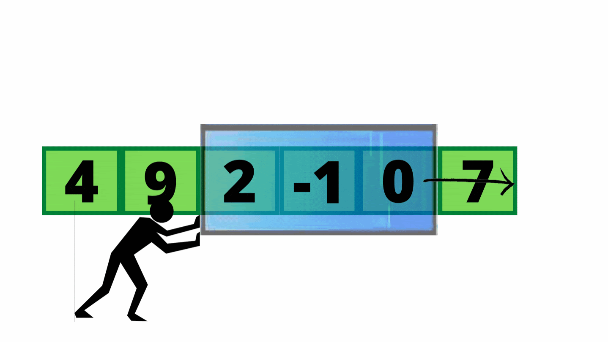

# What is Sliding Window?

A sliding window is a sub-array or range-based technique used to reduce nested loops into O(n) or O(n log n) solutions.

It is typically applied to:

* Arrays
* Strings
* Lists



## Types

| Type                     | Description                            | Use Case                                             |
|--------------------------|----------------------------------------|------------------------------------------------------|
| **Fixed Size Window**    | Window size is constant                | Max sum of size K                                    |
| **Variable Size Window** | Window size changes dynamically        | Longest substring with at most K distinct characters |
| **Monotonic Window**     | Maintains max/min using deque          | Sliding window maximum                               |
| **Two Pointer Window**   | Adjusts start and end using conditions | Longest substring without repeating chars            |

## 1. Fixed Size Window

A fixed-size sliding window involves keeping a subarray of fixed length k, and you move the window one element at a time
through the array.

Used when:
You need the result (sum, max, average, etc.) of every subarray of length k.

| Concept          | Description                                             |
|------------------|---------------------------------------------------------|
| **Window Size**  | Always `k`                                              |
| **Add Right**    | Add `arr[i]`                                            |
| **Remove Left**  | Remove `arr[i - k]`                                     |
| **No Shrinking** | Window size never changes                               |
| **O(n)**         | Linear time — because each element added & removed once |

```
int maxSum = 0, windowSum = 0;
for (int i = 0; i < k; i++) windowSum += arr[i];

maxSum = windowSum;
for (int i = k; i < arr.length; i++) {
    windowSum += arr[i] - arr[i - k];
    maxSum = Math.max(maxSum, windowSum);
}
```

## 2. Variable Size Window

Unlike fixed size, where window size is constant (like k), in variable size, the window grows or shrinks based on a
condition.

#### The general steps to solve these questions by following below steps:

* In this type of sliding window problem, we increase our right pointer one by one till our condition is true.
* At any step if our condition does not match, we shrink the size of our window by increasing left pointer.
* Again, when our condition satisfies, we start increasing the right pointer and follow step 1.
* We follow these steps until we reach to the end of the array.


**Template simple**
```
int i = 0, j = 0; // i = start, j = end
while (j < n) {
// 1. Expand the window by moving j
// Add nums[j] or process nums[j]

    // 2. If condition is NOT met
    while (invalidCondition) {
        // Shrink the window from the left
        // Remove nums[i] or reverse the effect
        i++;
    }

    // 3. When condition is met, update result
    // Possibly: result = max/min/count...

    j++;
}
```
| Problem                   | Keyword             | Example                                       |
|---------------------------|---------------------|-----------------------------------------------|
| Longest/Shortest subarray | based on sum, chars | Subarray with sum ≤ K                         |
| Count of subarrays        | with constraint     | At most K distinct characters                 |
| Frequency                 | unique chars/count  | Longest substring with at most K unique chars |
